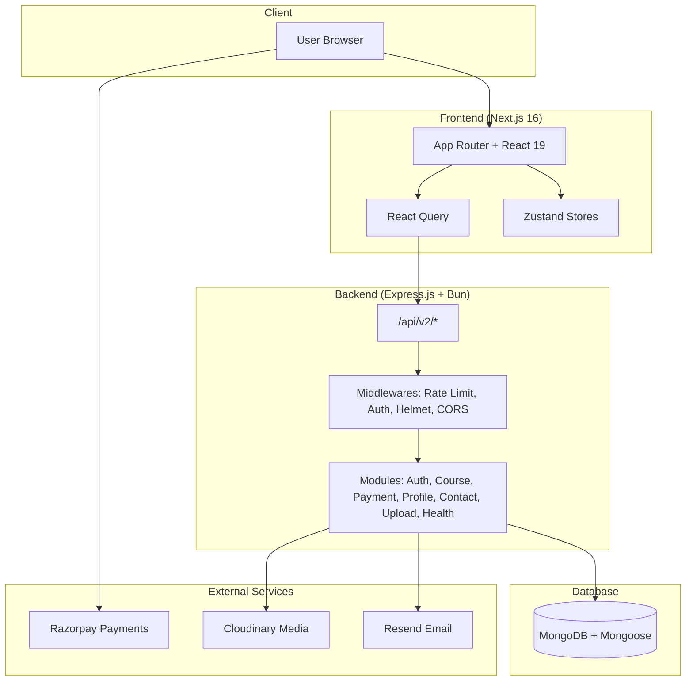

<div align="center">
  <br />
  <a href="https://academy.aayushbharti.in" target="_blank">
    
  </a>
  <br />
  <div>
    
    
    
    
    
  </div>
  <h1>Nextdemy</h1>
  <h3>Online Education Platform for You</h3>
  <p><a href="https://academy.aayushbharti.in" target="_blank"><b>Check Live</b></a></p>
</div>

## Table of Contents

1. [Introduction](#introduction)
2. [Tech Stack](#tech-stack)
3. [Monorepo Structure](#monorepo-structure)
4. [Features](#features)
5. [Architecture](#architecture)
6. [API Reference](#api-reference)
7. [Getting Started](#getting-started)
8. [Contributing](#contributing)

---

## Introduction

Nextdemy is a fully functional ed-tech platform enabling users to create, consume, and rate educational content. Built as a **Turborepo monorepo** with a Next.js frontend and Express.js API, it provides:

- A seamless and interactive learning experience for students.
- A platform for instructors to showcase expertise and connect globally.

Explore the platform: [Nextdemy Live](https://academy.aayushbharti.in)

---

## Tech Stack

| Category | Technology | Description |
|---|---|---|
| **Frontend** | Next.js 16 (App Router), React 19, TypeScript, Tailwind CSS 4, Zustand v5, TanStack React Query v5, Motion (Framer Motion), shadcn/ui | SSR with App Router, feature-based architecture, server state via React Query, client state via Zustand, dark/light mode with next-themes |
| **Backend** | Express.js, Mongoose, Zod, Bun runtime, JWT (access + refresh tokens), Bcrypt, Razorpay, Cloudinary, Resend | Domain-driven modular API (`routes > controllers > services > models`), Zod validation, Pino logging, rate limiting |
| **Shared** | Zod schemas + TypeScript types (`@workspace/shared-types`), shadcn/ui component library (`@workspace/ui`) | Shared types and 30+ UI components across apps |
| **Tools** | Turborepo, Bun 1.2.5, Biome (linting/formatting), Docker | Monorepo orchestration, fast installs/builds, consistent code style |

---

## Monorepo Structure

```
nextdemy/
├── apps/
│   ├── api/                    # Express.js API (Bun runtime)
│   │   └── src/
│   │       ├── configs/        # Zod-validated env, DB, Cloudinary, Razorpay, Resend
│   │       ├── modules/        # Domain modules (auth, course, payment, profile, contact, upload, health)
│   │       │   └── <module>/   # routes > controllers > services > models
│   │       ├── shared/         # Middlewares, utils (ApiResponse, ApiError, asyncHandler, logger)
│   │       └── types/          # Custom type declarations
│   └── web/                    # Next.js 16 App (React 19)
│       ├── app/                # App Router pages
│       │   ├── (auth)/         # Login, signup, forgot-password, verify-email
│       │   ├── (dashboard)/    # Profile, analytics, courses, cart, settings
│       │   ├── about/
│       │   ├── catalog/
│       │   ├── contact/
│       │   └── courses/
│       ├── features/           # Feature-based modules
│       │   ├── auth/           # components, hooks, store
│       │   ├── course/         # components, hooks, store
│       │   ├── cart/           # components, store
│       │   ├── dashboard/      # components (analytics charts, sidebar, header)
│       │   ├── payment/        # hooks
│       │   ├── profile/        # hooks, store
│       │   ├── navigation/     # navbar, mobile menu
│       │   ├── home/           # homepage sections
│       │   ├── about/          # about page sections
│       │   └── shared/         # shared components
│       └── lib/                # API connector, React Query config, utils
├── packages/
│   ├── shared-types/           # Zod schemas + inferred TS types (auth, course, payment, user, contact, upload)
│   ├── ui/                     # shadcn/ui component library (30+ components)
│   └── typescript-config/      # Shared TS configs
├── turbo.json
└── package.json
```

---

## Features

### For Students

- **Course Catalog** — Browse courses with descriptions, ratings, and instructor details
- **Cart & Checkout** — Razorpay-powered payment processing
- **Course Player** — Video player with section/subsection navigation and progress tracking
- **Enrolled Courses** — Track enrolled courses and completion progress
- **Payment History** — View past transactions
- **Profile** — Manage personal information and account settings

### For Instructors

- **Analytics Dashboard** — Revenue charts (donut, bar, radial), student enrollment stats, top performers table
- **Course Management** — Create, edit, and delete courses with sections and video subsections
- **Media Uploads** — Cloudinary integration for thumbnails and video content
- **Earnings Tracking** — View total earnings and per-course revenue breakdown

### Platform

- **Authentication** — JWT access/refresh token flow with OTP email verification
- **Responsive Design** — Mobile-first UI with Tailwind CSS 4 and dark/light mode
- **Sticky Dashboard Header** — Breadcrumb navigation with frosted glass effect
- **Split-screen Auth Pages** — Random HD Unsplash abstract images on each visit
- **RESTful API v2** — Modular Express.js routes with Zod validation and structured error handling

---

## Architecture



---

## API Reference

All routes are prefixed with `/api/v2/`.

### Auth (`/api/v2/auth`)

| Method | Endpoint | Auth | Description |
|---|---|---|---|
| POST | `/login` | | Authenticate user, return access + refresh tokens |
| POST | `/signup` | | Register new user (student/instructor) |
| POST | `/logout` | Yes | Invalidate refresh token |
| POST | `/refresh-token` | | Refresh access token via httpOnly cookie |
| POST | `/sendotp` | | Send OTP to email for verification |
| POST | `/changepassword` | Yes | Change password |
| POST | `/reset-password-token` | | Generate password reset token |
| POST | `/reset-password` | | Reset password with token |

### Profile (`/api/v2/profile`)

| Method | Endpoint | Auth | Description |
|---|---|---|---|
| GET | `/getUserDetails` | Yes | Get current user details |
| PUT | `/updateProfile` | Yes | Update profile information |
| POST | `/updateDisplayPicture` | Yes | Upload profile picture (multipart) |
| DELETE | `/deleteProfile` | Yes | Delete account |
| GET | `/getEnrolledCourses` | Yes | List enrolled courses |
| GET | `/getInstructorDashboardDetails` | Instructor | Analytics dashboard data |

### Course (`/api/v2/course`)

| Method | Endpoint | Auth | Description |
|---|---|---|---|
| POST | `/createCourse` | Instructor | Create course (multipart: thumbnail) |
| POST | `/editCourse` | Instructor | Edit course details |
| DELETE | `/deleteCourse` | Yes | Delete course |
| GET | `/getAllCourses` | | List all courses |
| POST | `/getCourseDetails` | | Get course details |
| POST | `/getFullCourseDetails` | Yes | Get full course content |
| GET | `/getInstructorCourses` | Instructor | List instructor's courses |
| POST | `/searchCourse` | | Search courses by keyword |
| POST | `/addSection` | Instructor | Add section to course |
| POST | `/updateSection` | Instructor | Update section |
| POST | `/deleteSection` | Instructor | Delete section |
| POST | `/addSubSection` | Instructor | Add subsection (multipart: video) |
| POST | `/updateSubSection` | Instructor | Update subsection |
| POST | `/deleteSubSection` | Instructor | Delete subsection |
| POST | `/updateCourseProgress` | Student | Mark lecture as complete |
| POST | `/createCategory` | Admin | Create category |
| GET | `/showAllCategories` | | List all categories |
| POST | `/getCategoryPageDetails` | | Get category page details |
| POST | `/addCourseToCategory` | Instructor | Assign course to category |
| POST | `/createRating` | Student | Submit rating and review |
| GET | `/getAverageRating` | | Get average rating |
| GET | `/getReviews` | | List all reviews |

### Payment (`/api/v2/payment`)

| Method | Endpoint | Auth | Description |
|---|---|---|---|
| POST | `/capturePayment` | Student | Initiate Razorpay payment |
| POST | `/verifyPayment` | Yes | Verify payment signature |
| POST | `/sendPaymentSuccessEmail` | Yes | Send payment confirmation email |
| GET | `/history` | Yes | Get payment history |
| GET | `/instructor-earnings` | Instructor | Get instructor earnings |

### Contact (`/api/v2/contact`)

| Method | Endpoint | Auth | Description |
|---|---|---|---|
| POST | `/contactUs` | | Submit contact form |

### Upload (`/api/v2/upload`)

| Method | Endpoint | Auth | Description |
|---|---|---|---|
| POST | `/file` | | Upload single file |
| POST | `/files` | | Upload multiple files (max 10) |
| DELETE | `/` | | Delete file |

### Health (`/api/v2/health`)

| Method | Endpoint | Description |
|---|---|---|
| GET | `/` | Server health check |

---

## Getting Started

### Prerequisites

- [Bun](https://bun.sh/) v1.2.5+
- [Git](https://git-scm.com/)
- MongoDB instance
- Cloudinary, Razorpay, and Resend accounts (for full functionality)

### Setup

```bash
# Clone the repository
git clone https://github.com/aayushbharti/nextdemy.git
cd nextdemy

# Install dependencies
bun install

# Set up environment variables
cp apps/api/.env.example apps/api/.env
# Edit apps/api/.env with your credentials

# Run all apps in development mode
bun run dev

# Or run individually
bun run dev:api    # API on configured port
bun run dev:web    # Web on port 3000
```

### Available Scripts

```bash
bun run dev          # Dev mode (all apps)
bun run build        # Build all apps
bun run lint         # Biome linter
bun run format       # Ultracite formatter
bun run fix          # Biome auto-fix
```

---

## Contributing

We welcome contributions from the community.

1. **Fork** the repository
2. **Clone** your fork: `git clone https://github.com/your-username/nextdemy.git`
3. **Install** dependencies: `bun install`
4. **Create** a branch: `git checkout -b feature/your-feature`
5. **Make** your changes
6. **Commit**: `git commit -m "Add your feature"`
7. **Push**: `git push origin feature/your-feature`
8. **Open** a Pull Request

### Guidelines

- Keep PRs focused and atomic
- Write clear commit messages
- Follow existing code style (Biome handles formatting)
- Test thoroughly before submitting

---

## Contributors

<a href="https://github.com/aayushbharti/nextdemy/graphs/contributors">
  
</a>

---

<p align="center">Built with care by <a href="https://github.com/AayushBharti">Aayush Bharti</a></p>
